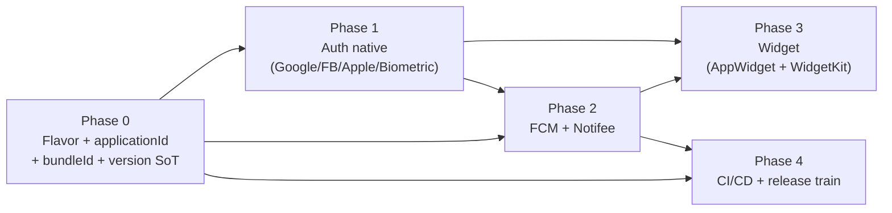

# Mapper – Phân tích nghiệp vụ & kiến trúc 4 khối tính năng nền

> Phạm vi: FCM + Local Notification (Notifee) · Login native (Google / Facebook / Apple / Biometric) · Widget (Android AppWidget + iOS WidgetKit) · Flavor dev–prod + chiến lược version/build.
>
> Tài liệu này là **phân tích + quyết định kiến trúc**, chưa phải code triển khai. Mỗi khối có 1 file chi tiết riêng.

| # | Tài liệu | Nội dung |
|---|---|---|
| 01 | [01-FLAVOR-VERSIONING.md](./01-FLAVOR-VERSIONING.md) | Flavor dev/prod 2 nền tảng, version/build number, release train, so sánh với Flutter |
| 02 | [02-AUTH-NATIVE.md](./02-AUTH-NATIVE.md) | Google / Facebook / Apple / Biometric, kiến trúc token, phần native phải tự viết |
| 03 | [03-NOTIFICATION.md](./03-NOTIFICATION.md) | FCM + Notifee, payload contract, matrix trạng thái app, deep link |
| 04 | [04-WIDGET.md](./04-WIDGET.md) | AppWidget/Glance + WidgetKit, cơ chế chia sẻ dữ liệu RN ↔ widget |
| 05 | [05-CHOT-QUYET-DINH.md](./05-CHOT-QUYET-DINH.md) | Chốt 8 câu hỏi + phân tích lại 4 chỗ bị thay đổi khuyến nghị |
| 06 | [06-FLAVOR-BUILD-NUMBER.md](./06-FLAVOR-BUILD-NUMBER.md) | 3 flavor × 2 dạng build; build number **tách theo flavor** (đang dùng) + **code đầy đủ** cho phương án dùng chung một counter |
| 07 | [07-IOS-FLAVOR-XCODE.md](./07-IOS-FLAVOR-XCODE.md) | 8 bước tay để dựng flavor iOS trong Xcode (configuration, scheme, xcconfig, Firebase, widget target) |
| 08 | [08-BASE-HUONG-DAN.md](./08-BASE-HUONG-DAN.md) | **Đọc file này trước khi build lần đầu.** Bản đồ thư mục, lệnh hằng ngày, danh sách giá trị phải điền, quy ước viết code |

> Tài liệu 01–05 là **phân tích trước khi code**. Tài liệu 06–08 mô tả **code đã dựng thật** trong repo.

> ⚠️ Một số khuyến nghị trong file 01, 02, 04 đã được **cập nhật** ở file 05 sau khi chốt yêu cầu. Chỗ nào lệch nhau thì **file 05 thắng**.

---

## 1. Hiện trạng base (đọc từ repo, ngày 2026-07-27)

**Đã có:**

- `react-native@0.79.0`, `react@19.0.0`, **New Architecture bật** (`newArchEnabled=true`), Hermes bật.
- Navigation 7 + `react-native-screens@4.14.0`, Reanimated 4.1 + worklets 0.5.1, MMKV 4 + Nitro, zustand, i18next, react-hook-form, dayjs.
- Android: `namespace/applicationId = com.mapper`, `minSdk 24`, `compileSdk/targetSdk 35`, `versionCode 1`, `versionName "1.0"`, Kotlin 2.0.21, AGP mặc định.
- iOS: target `Mapper`, `AppDelegate.swift` kiểu **RCTReactNativeFactory** (chuẩn RN 0.77+), min iOS deployment = **15.1** (`react-native/scripts/cocoapods/helpers.rb`).

**Chưa có (đúng nghĩa base trắng):**

- Không có bất kỳ lib nào cho firebase / notifee / auth / widget / env.
- Chưa có flavor, chưa có scheme iOS thứ 2, chỉ 1 scheme `Mapper`.
- `src/services/index.tsx`, `src/services/Auth/Routes.ts`, `src/routers/index.tsx` là **file rỗng 0 byte** → tầng service/router chưa dựng.
- Chưa có CI, chưa có fastlane, chưa có `.env`.

**3 rủi ro phải xử lý trước khi làm gì khác:**

1. `android/app/build.gradle`: **buildType `release` đang ký bằng `debug.keystore`**. Không thể lên store, và nếu lỡ phát hành 1 bản thì vĩnh viễn không đổi được key. → Phải tạo upload keystore + bật Play App Signing trước phase release.
2. `versionCode 1` / `versionName "1.0"` hardcode trong gradle, iOS thì nằm trong `project.pbxproj` → 2 nguồn sự thật, chắc chắn lệch. → Phải gom về 1 nguồn (mục 01).
3. `android:enableOnBackInvokedCallback="false"` – Android 15+ (targetSdk 35) predictive back đã bật mặc định ở system level; để `false` là tạm ổn nhưng cần lên kế hoạch bật khi navigation ổn định.

---

## 2. Kết luận quan trọng nhất: **thứ tự triển khai**

Đây là phần "nghiệp vụ" cần chốt trước, vì làm sai thứ tự sẽ phải làm lại 2–3 lần.

**Vì sao Flavor phải đi trước tất cả:**

| Thứ phụ thuộc | Phụ thuộc vào cái gì | Hậu quả nếu làm flavor sau |
|---|---|---|
| Firebase (FCM) | `applicationId` + `bundleId` + SHA-1/SHA-256 | Phải tạo lại app trong Firebase console, tải lại `google-services.json` / `GoogleService-Info.plist` cho từng flavor |
| Google Sign-In | OAuth client gắn cứng theo package + SHA fingerprint | Mỗi flavor × mỗi keystore = 1 OAuth client Android. Làm sau = khai báo lại toàn bộ |
| Facebook Login | Key hash Android theo keystore, URL scheme iOS theo App ID | Có thể phải tách 2 FB App (dev/prod) |
| Sign in with Apple | Capability gắn theo App ID (bundle id) | Phải tạo thêm App ID + provisioning profile |
| Widget | **App Group** iOS `group.<bundleId>` + widget extension bundle id | Đổi bundle id sau = mất dữ liệu shared, phải cấu hình lại toàn bộ App Group |
| APNs | Entitlement `aps-environment` theo từng configuration | Push dev bắn vào bản prod hoặc ngược lại |

→ **Chốt: Phase 0 (flavor + định danh + version) làm trước, không thương lượng.**

---

## 3. Bảng quyết định thư viện (đề xuất)

Phiên bản latest tại thời điểm khảo sát (đã kiểm tra trên npm registry hôm nay). **Bắt buộc áp dụng "Nguyên tắc vàng" trong `TurioldBase.md`**: sau khi cài, đọc `node_modules/<lib>/README.md` + docs đúng tag, không copy docs bản mới hơn.

| Nhu cầu | Lib chọn | Latest | Ghi chú rủi ro cần verify với RN 0.79 |
|---|---|---|---|
| FCM transport | `@react-native-firebase/app` + `/messaging` | 25.1.0 | v25 kéo Firebase iOS SDK mới → **check min iOS deployment target** có vượt 15.1 không. Nếu vượt, hoặc nâng `platform :ios` trong Podfile, hoặc hạ về dòng v22/v23. Peer deps khai `react-native: *` nên **không tin peer deps**, phải build thử. |
| Hiển thị notification | `@notifee/react-native` | 9.1.8 | Kiểm tra New Arch/Fabric + Kotlin 2.0.21 compile. Notifee là thư viện hiển thị, **không** thay thế FCM. |
| Google | `@react-native-google-signin/google-signin` | 16.1.2 | Bản ≥13 dùng **Credential Manager** trên Android → bắt buộc `webClientId`, không dùng lại luồng cũ. |
| Facebook | `react-native-fbsdk-next` | 13.4.3 | iOS phải tự forward `openURL` trong `AppDelegate.swift` (RN 0.79 dùng Swift AppDelegate, docs cũ viết cho Obj-C). |
| Apple | `@invertase/react-native-apple-authentication` | 2.5.1 | iOS native; Android chạy web flow (`appleAuthAndroid`) nếu cần. |
| Lưu secret + biometric gate | `react-native-keychain` | 10.0.0 | Là lõi bảo mật (xem 02). |
| Biometric challenge/ký số | `react-native-biometrics` | 3.0.1 | Chỉ cần nếu có step-up auth / xác nhận giao dịch. |
| Env theo flavor | `react-native-config` | 1.6.1 | Lib cũ, **rủi ro New Arch cao nhất trong danh sách** → có phương án B thuần JS ở file 01. |
| Widget Android | `react-native-android-widget` | 0.21.0 | Viết widget bằng JSX, render ra RemoteViews. Nếu widget phức tạp/nhiều → cân nhắc Glance native. |
| Widget iOS | *(không có lib)* | – | Bắt buộc viết WidgetKit extension bằng SwiftUI + 1 native module nhỏ để ghi App Group. |

**Nguyên tắc pin version cho project này** (giống cách đã pin `react-native-screens@4.14.0`): mọi lib native đụng tới build đều pin **cứng, không `^`**.

---

## 4. Ước lượng khối lượng

| Phase | Hạng mục | Dev-day (1 dev) | Ghi chú |
|---|---|---|---|
| 0 | Flavor Android + iOS scheme/config, version SoT, script build | 3–4 | iOS chiếm ~60% thời gian (xcconfig + scheme + Podfile mapping) |
| 0 | Keystore, Play App Signing, App Store Connect app records | 1 | Cần tài khoản, phụ thuộc bên ngoài |
| 1 | Kiến trúc token + Keychain + biometric mức 2 | 2–3 | |
| 1 | **Biometric mức 3** – ký số xác nhận giao dịch (đã chốt là có) | 2 | Cần BE làm 3 endpoint, xem file 05 mục 6 |
| 1 | Google + Facebook + Apple (mỗi provider ~1 ngày kể cả console) | 3–4 | Console setup chiếm nửa thời gian |
| 2 | FCM + Notifee full matrix (fg/bg/quit, deep link, channel) | 3–4 | +1 nếu cần Notification Service Extension (ảnh trong push) |
| 3 | Widget Android | 2–3 | |
| 3 | Widget iOS (WidgetKit + App Group + native module) | 3–4 | |
| 4 | CI/CD (build 4 variant, upload App Distribution/TestFlight) | 3–5 | Tùy nền tảng CI |
| | **Tổng** | **~22–30 dev-day** | Chưa tính BE và QA |

---

## 5. Việc phía Backend (phải chốt sớm, chặn FE)

1. `POST /auth/social` – nhận `{provider, idToken|accessToken, nonce?, deviceId, platform}` → verify chữ ký token với Google/Apple/Facebook → trả `{accessToken, refreshToken, expiresIn, user}`.
2. `POST /auth/refresh` – single-flight, rotate refresh token.
3. `POST /devices/push-token` + `DELETE /devices/push-token` – gắn/gỡ FCM token theo `deviceId` (không theo user, để logout không xoá nhầm thiết bị khác).
4. `DELETE /auth/account` – xoá tài khoản + **revoke Apple token** (bắt buộc theo App Store 5.1.1(v)).
5. Push payload đúng contract ở file 03 (khác nhau giữa Android và iOS – rất quan trọng).
6. `GET /widget/snapshot` (nếu widget lấy data trực tiếp) – hoặc không cần nếu chọn phương án app-ghi-snapshot (khuyến nghị).

---

## 6. Câu hỏi cần chốt → **đã chốt, xem [05-CHOT-QUYET-DINH.md](./05-CHOT-QUYET-DINH.md)**

| # | Câu hỏi | Kết quả |
|---|---|---|
| 1 | 2 Firebase project hay 1 project 2 app? | **2 project** riêng dev/prod |
| 2 | Apple Developer + Play Console? | Đã có, tự xử lý – bỏ khỏi scope |
| 3 | CI dùng gì? | **Không có CI**, bump tay → giải pháp `scripts/bump.js` (file 05 mục 3) |
| 4 | Bắt buộc login? | **Có.** Chưa login không được dùng widget (file 05 mục 5) |
| 5 | Widget hiển thị gì, tần suất? | **5 phút/lần, hằng số theo bản build** – vướng giới hạn OS, xem file 05 mục 4 |
| 6 | Push có ảnh / nút hành động? | Chưa chốt – mặc định **không**; cần thì +1 dev-day (Notification Service Extension) |
| 7 | Xác nhận giao dịch bằng vân tay (ký số)? | **Có** → bắt buộc Biometric **mức 3** (file 05 mục 6) |
| 8 | Kênh phát hành bản dev? | **TestFlight + Play Internal testing** → ⚠️ **cấm ghi đè build number** |

**Còn duy nhất 1 câu chưa trả lời:** dữ liệu widget đổi mỗi 5 phút là *suy ra từ thời gian* hay *lấy từ server*? (file 05 mục 8)

---

## 7. Tóm tắt các quyết định kiến trúc đã đề xuất

1. **Flavor bằng `productFlavors` (Android) + `build configurations` & 2 scheme (iOS)** – không tách target iOS riêng.
2. **`applicationId`/`bundleId` khác nhau giữa dev và prod** → cài song song 2 app trên 1 máy.
3. **1 nguồn sự thật version = `package.json`**; `scripts/bump.js` đồng bộ sang `Version.xcconfig`, Gradle đọc thẳng `package.json`.
4. ~~Ghi đè build number được phép ở kênh nội bộ~~ → **CẤM ghi đè ở mọi nơi**, vì kênh nội bộ là TestFlight + Play Internal (file 05 mục 3).
5. **Push: Android gửi data-only (Notifee toàn quyền), iOS gửi APNs alert + data** – đây là điểm khác biệt bắt buộc, không dùng chung 1 payload.
6. **Token: refresh token nằm trong Keychain/Keystore có khoá sinh trắc học**, access token trong memory; biometric không phải là "màn hình khoá cho đẹp". Thêm **mức 3 (ký số challenge)** cho xác nhận giao dịch.
7. **Widget đọc snapshot do app ghi ra App Group / SharedPreferences**, không tự gọi API ở bản đầu; nhịp 5 phút đạt được bằng **pre-compute timeline**, không phải bằng reload 5 phút/lần.
8. **Mỗi flavor là một app record riêng** trên Play Console và App Store Connect (giống cách đang làm với Flutter).
