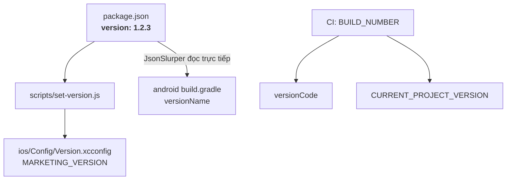
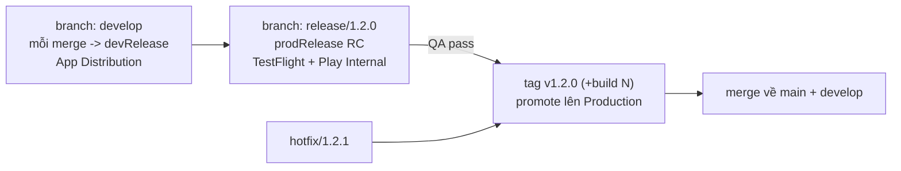

# 01 – Flavor dev/prod & chiến lược Version / Build number

> Trả lời trực tiếp câu hỏi: *"chia môi trường flavor cho dev và prod như thế nào; trước đây tôi ghi đè version build, đến bản phù hợp mới đẩy store; còn Flutter thì tôi chia flavor và các phiên bản để check"*.

---

## 1. Mô hình môi trường đề xuất

| Trục | Giá trị | Ý nghĩa |
|---|---|---|
| **Flavor (env)** | `dev`, `prod` | Khác **định danh app** (applicationId/bundleId), khác backend, khác Firebase project, khác icon & tên hiển thị |
| **Build type** | `debug`, `release` | Khác **cách build JS** (Metro vs bundle nhúng), khác signing, khác minify |

→ 4 variant: `devDebug`, `devRelease`, `prodDebug`, `prodRelease`.

**Bảng ma trận vận hành (đây là phần "nghiệp vụ" cần chốt với team):**

| Variant | Định danh | Backend | Firebase | Ký bằng | Dùng để | Được ghi đè build number? |
|---|---|---|---|---|---|---|
| `devDebug` | `com.mapper.dev` | API dev | mapper-dev | debug key | Dev chạy máy, Metro live reload | ✅ Thoải mái |
| `devRelease` | `com.mapper.dev` | API dev | mapper-dev | upload key dev | **QA test nội bộ**, App Distribution / ad-hoc | ✅ Có (xem mục 5) |
| `prodDebug` | `com.mapper` | API prod | mapper-prod | debug key | Debug bug chỉ xảy ra ở prod data | ✅ Không phát hành |
| `prodRelease` | `com.mapper` | API prod | mapper-prod | **upload key prod** | Play Store / App Store / TestFlight | ❌ **Cấm** – phải tăng đơn điệu |

Vì `applicationId` khác nhau → **cài song song dev và prod trên cùng 1 máy**, đây là lợi ích lớn nhất so với cách cũ (ghi đè cùng 1 app).

---

## 2. Ánh xạ Flutter → React Native (cho dễ hình dung)

| Việc bạn làm ở Flutter | Tương đương ở React Native (Android) | Tương đương ở React Native (iOS) |
|---|---|---|
| `productFlavors` trong `android/app/build.gradle` | **Giống hệt** – `productFlavors { dev {} prod {} }` | Không có khái niệm flavor → dùng **Build Configuration + Scheme** |
| `--flavor dev` | `./gradlew assembleDevRelease` | `xcodebuild -scheme "Mapper Dev" -configuration "Release-dev"` |
| `-t lib/main_dev.dart` (entry point riêng) | Không cần – RN chỉ có 1 `index.js`, env inject qua build | Như Android |
| `--dart-define=API_URL=...` | `.env.dev` + `react-native-config` (hoặc phương án B mục 6) | Như Android |
| `--build-name=1.2.3` | `versionName` (đọc từ `package.json`) | `MARKETING_VERSION` (xcconfig) |
| `--build-number=45` | `versionCode` (từ `-PversionCode` hoặc `BUILD_NUMBER`) | `CURRENT_PROJECT_VERSION` (xcconfig) |
| `flutter run --flavor dev` | `yarn android:dev` | `yarn ios:dev` |
| `google-services.json` theo flavor folder | **Giống hệt** – `android/app/src/dev/google-services.json` | Run Script copy `GoogleService-Info-<env>.plist` theo `$CONFIGURATION` |
| `flavorDimensions` | Giống hệt | – |

**Điểm khác biệt lớn nhất cần chấp nhận:** iOS **không có** cơ chế flavor nào tương đương Flutter/Gradle. Bạn phải tự dựng bằng Build Configurations + Schemes + xcconfig, và **Podfile phải khai báo mapping configuration**, nếu quên thì `pod install` sẽ hỏng build.

---

## 3. Android – cấu hình cụ thể

### 3.1 `android/app/build.gradle`

```gradle
import groovy.json.JsonSlurper

// ---- 1 nguồn sự thật cho version ----
def pkg = new JsonSlurper().parseText(file("../../package.json").text)
def appVersionName = pkg.version                                  // "1.2.3"
def appVersionCode = (project.findProperty("versionCode")
                      ?: System.getenv("BUILD_NUMBER")
                      ?: "1") as Integer

// ---- map variant -> file .env cho react-native-config ----
project.ext.envConfigFiles = [
    devdebug    : ".env.dev",
    devrelease  : ".env.dev",
    proddebug   : ".env.prod",
    prodrelease : ".env.prod",
]
apply from: project(':react-native-config').projectDir.getPath() + "/dotenv.gradle"

react {
    autolinkLibrariesWithApp()
    // BẮT BUỘC khi có flavor: mặc định chỉ là ["debug"], không khớp tên variant mới
    debuggableVariants = ["devDebug", "prodDebug"]
}

android {
    namespace "com.mapper"

    defaultConfig {
        applicationId "com.mapper"
        minSdkVersion rootProject.ext.minSdkVersion
        targetSdkVersion rootProject.ext.targetSdkVersion
        versionCode appVersionCode
        versionName appVersionName
    }

    flavorDimensions "env"
    productFlavors {
        dev {
            dimension "env"
            applicationIdSuffix ".dev"
            versionNameSuffix "-dev"
            resValue "string", "app_name", "Mapper Dev"
        }
        prod {
            dimension "env"
            resValue "string", "app_name", "Mapper"
        }
    }

    signingConfigs {
        debug { /* giữ nguyên */ }
        release {
            storeFile     file(System.getenv("KEYSTORE_FILE")     ?: "release.keystore")
            storePassword System.getenv("KEYSTORE_PASSWORD")
            keyAlias      System.getenv("KEY_ALIAS")
            keyPassword   System.getenv("KEY_PASSWORD")
        }
    }

    buildTypes {
        debug   { signingConfig signingConfigs.debug }
        release {
            signingConfig signingConfigs.release   // ❗ hiện đang là debug -> PHẢI SỬA
            minifyEnabled enableProguardInReleaseBuilds
            proguardFiles getDefaultProguardFile("proguard-android.txt"), "proguard-rules.pro"
        }
    }
}
```

### 3.2 Các điểm dễ sai (đã thấy nhiều dự án dính)

1. **`app_name` trùng resource**: khi khai `resValue "string", "app_name"` thì **phải xoá** `<string name="app_name">` trong `android/app/src/main/res/values/strings.xml`, nếu không build lỗi *duplicate resource*.
2. **`debuggableVariants`**: không khai → `devDebug` bị coi là release variant → gradle sẽ chạy bundle JS mỗi lần build debug (chậm khủng khiếp) hoặc lỗi thiếu bundle.
3. **`google-services.json` theo flavor**: đặt ở `android/app/src/dev/google-services.json` và `android/app/src/prod/google-services.json`, **không** để ở `android/app/`. `package_name` trong file phải khớp `com.mapper.dev` / `com.mapper`.
4. **SHA-1/SHA-256**: mỗi cặp (applicationId × keystore) là **một** OAuth client Android. Tối thiểu cần 4: dev-debug, dev-release, prod-debug(nếu dùng), prod-release. Nếu bật **Play App Signing** thì phải thêm SHA của **App signing key** do Google cấp (không phải upload key) — thiếu cái này là lỗi kinh điển "Google Sign-In chạy được bản nội bộ, lên store thì DEVELOPER_ERROR".
5. **Icon/tên khác nhau cho dev**: đặt icon riêng ở `android/app/src/dev/res/mipmap-*` để QA phân biệt bằng mắt.

---

## 4. iOS – cấu hình cụ thể

### 4.1 Cấu trúc

```
Build Configurations:  Debug-dev | Release-dev | Debug-prod | Release-prod
Schemes:               "Mapper Dev"  (Debug-dev / Release-dev)
                       "Mapper"      (Debug-prod / Release-prod)
xcconfig:              ios/Config/Version.xcconfig   (dùng chung, chứa version)
                       ios/Config/Dev.xcconfig
                       ios/Config/Prod.xcconfig
```

`ios/Config/Version.xcconfig` — **nguồn sự thật version của iOS**:

```
MARKETING_VERSION = 1.2.3
CURRENT_PROJECT_VERSION = 45
```

`ios/Config/Dev.xcconfig`:

```
#include "Version.xcconfig"
APP_BUNDLE_SUFFIX = .dev
APP_DISPLAY_NAME  = Mapper Dev
PRODUCT_BUNDLE_IDENTIFIER = com.mapper$(APP_BUNDLE_SUFFIX)
```

Trong build settings của target dùng:
`PRODUCT_BUNDLE_IDENTIFIER = com.mapper$(APP_BUNDLE_SUFFIX)`,
`INFOPLIST_KEY_CFBundleDisplayName = $(APP_DISPLAY_NAME)`.

### 4.2 Podfile – **bắt buộc** khai mapping

```ruby
project 'Mapper', {
  'Debug-dev'    => :debug,
  'Release-dev'  => :release,
  'Debug-prod'   => :debug,
  'Release-prod' => :release,
}
```

Thiếu dòng này, CocoaPods không biết `Release-dev` là bản release → link nhầm build settings, lỗi lúc archive.

### 4.3 Run Script chọn `GoogleService-Info.plist`

Đặt 2 file `ios/Firebase/GoogleService-Info-dev.plist`, `-prod.plist`, thêm Build Phase **trước** "Copy Bundle Resources":

```bash
case "${CONFIGURATION}" in
  *dev*)  SRC="${PROJECT_DIR}/Firebase/GoogleService-Info-dev.plist" ;;
  *)      SRC="${PROJECT_DIR}/Firebase/GoogleService-Info-prod.plist" ;;
esac
cp -f "$SRC" "${BUILT_PRODUCTS_DIR}/${PRODUCT_NAME}.app/GoogleService-Info.plist"
```

### 4.4 Entitlements theo môi trường

- `aps-environment`: `development` cho Debug-*, `production` cho Release-*. Sai chỗ này = push im lặng, không báo lỗi gì.
- **App Group** (cần cho Widget, xem file 04): `group.com.mapper.dev` và `group.com.mapper` → nên dùng 2 file `.entitlements` riêng, gán theo configuration.
- Capability **Sign in with Apple** phải bật cho **cả 2** App ID trên Apple Developer portal.

---

## 5. Chiến lược Version & Build number

### 5.1 Phân biệt 2 khái niệm (nguồn gốc mọi nhầm lẫn)

| | Android | iOS | Ai quyết định |
|---|---|---|---|
| **Version hiển thị** (marketing) | `versionName` `"1.2.3"` | `CFBundleShortVersionString` / `MARKETING_VERSION` | **Con người** – theo semver, gắn với nội dung release |
| **Build number** (định danh gói) | `versionCode` (số nguyên) | `CFBundleVersion` / `CURRENT_PROJECT_VERSION` | **Máy/CI** – tăng đơn điệu, không mang ý nghĩa nghiệp vụ |

### 5.2 Quy tắc "ghi đè" – trả lời trực tiếp cách làm cũ của bạn

> ⚠️ **ĐÃ CẬP NHẬT** – xem [05-CHOT-QUYET-DINH.md](./05-CHOT-QUYET-DINH.md) mục 3.
> Vì kênh phát hành nội bộ đã chốt là **TestFlight + Play Internal testing** (không phải Firebase App Distribution), nên **không còn ô nào được phép ghi đè build number**. Bảng dưới giữ lại để hiểu luật của từng kênh.

Cách cũ (ghi đè build, khi nào ưng thì đẩy store) chỉ đúng khi kênh nội bộ nằm ngoài store:

| Kênh phát hành | Ghi đè build number? | Lý do kỹ thuật |
|---|---|---|
| Chạy máy dev, APK gửi tay, ad-hoc | ✅ Tự do | Không ai kiểm tra |
| **Firebase App Distribution** | ✅ Được (mỗi lần upload tạo release mới, cho phép trùng version) | Nhưng tester sẽ khó phân biệt bản → **nên** thêm hậu tố git short SHA vào versionName dev |
| **Google Play** (mọi track, kể cả internal testing) | ❌ Không | Play từ chối APK/AAB có `versionCode` đã tồn tại trong app đó |
| **TestFlight / App Store** | ❌ Không | Apple từ chối upload nếu cặp (`CFBundleShortVersionString`, `CFBundleVersion`) đã tồn tại |

→ **Quy tắc chốt:**

1. `versionName` chỉ đổi khi **nội dung release** đổi (semver). Nó **không** tăng theo mỗi lần build.
2. `versionCode`/`CFBundleVersion` = **số build của CI**, tăng 1 mỗi lần chạy pipeline, **không bao giờ reset**, dùng chung cho cả dev và prod (nghĩa là versionCode không liên tục giữa các bản store – điều này hoàn toàn hợp lệ, chỉ cần tăng dần).
3. Local build **không** cần quan tâm số: mặc định `1`.
4. CI **chặn** (fail pipeline) nếu lane store mà `BUILD_NUMBER` không được cấp.

### 5.3 Sơ đồ nguồn sự thật



`scripts/set-version.js` (phác thảo): đọc `package.json.version` → ghi lại `ios/Config/Version.xcconfig` → in ra để CI dùng. Chạy trong `postversion` hook để `yarn version --new-version 1.2.3` đồng bộ luôn iOS.

```json
{
  "scripts": {
    "postversion": "node scripts/set-version.js && git add ios/Config/Version.xcconfig"
  }
}
```

### 5.4 Nếu không có CI (giai đoạn đầu)

> **Đây chính là tình huống thực tế của dự án** (đã chốt: không có CI). Giải pháp áp dụng là `scripts/bump.js` + trường `buildNumber` trong `package.json` — xem [05-CHOT-QUYET-DINH.md](./05-CHOT-QUYET-DINH.md) mục 3. Phương án suy-từ-semver dưới đây **không dùng được** vì TestFlight cần build number khác nhau cho cùng một marketing version.

Dùng versionCode suy ra từ semver, chấp nhận giới hạn:

```
versionCode = major * 1_000_000 + minor * 10_000 + patch * 100 + hotfix
// 1.2.3 -> 1_020_300
```

Ưu: nhìn số biết version, không cần state bên ngoài, luôn tăng đơn điệu nếu semver tăng.
Nhược: không phân biệt được 2 lần build cùng version → **không dùng được cho TestFlight** (Apple cần build number khác nhau cho cùng marketing version). Với iOS vẫn phải có 1 counter tay.

---

## 6. Biến môi trường phía JS

### Phương án A – `react-native-config` (khuyến nghị nếu build được)

- Ưu: 1 cơ chế cho cả 2 nền tảng, tự map theo flavor (Android) / scheme (iOS), giá trị cũng dùng được trong `AndroidManifest.xml` và `Info.plist` (ví dụ Facebook App ID theo env).
- Nhược: lib native, bản 1.6.1 khá cũ → **phải build thử với New Arch RN 0.79 ngay ở spike đầu tiên**. Đây là rủi ro số 1 của Phase 0.

```
.env.dev    API_URL=https://api-dev.mapper.vn   ENV_NAME=dev
.env.prod   API_URL=https://api.mapper.vn       ENV_NAME=prod
```

### Phương án B – thuần JS (fallback nếu A hỏng với New Arch)

`babel-plugin-transform-inline-environment-variables` + `APP_ENV` truyền lúc bundle:

```js
// babel.config.js
plugins: [
  ['transform-inline-environment-variables', { include: ['APP_ENV'] }],
  'react-native-worklets/plugin', // luôn để cuối
]
```

```ts
// src/config/env.ts
const envs = { dev: {...}, prod: {...} } as const;
export const ENV = envs[process.env.APP_ENV ?? 'dev'];
```

- Ưu: 0 code native, không rủi ro tương thích.
- Nhược: **không** tự đồng bộ với flavor Gradle/Xcode – phải nhớ set `APP_ENV` khi chạy Metro, và phải `--reset-cache` khi đổi env. Không dùng được cho giá trị cần ở tầng native (Facebook App ID trong `strings.xml`) → phần đó khai bằng `resValue`/`manifestPlaceholders` của flavor.

**Đề xuất: thử A trước ở spike 0.5 ngày; hỏng thì lấy B + `resValue` cho phần native.**

---

## 7. Scripts đề xuất trong `package.json`

```json
{
  "scripts": {
    "android:dev":  "react-native run-android --mode=devDebug --appId com.mapper.dev",
    "android:prod": "react-native run-android --mode=prodDebug --appId com.mapper",
    "ios:dev":      "react-native run-ios --scheme \"Mapper Dev\" --mode Debug-dev",
    "ios:prod":     "react-native run-ios --scheme \"Mapper\" --mode Debug-prod",

    "build:android:dev":  "cd android && ./gradlew assembleDevRelease",
    "build:android:prod": "cd android && ./gradlew bundleProdRelease",

    "start:dev":  "APP_ENV=dev react-native start --reset-cache",
    "start:prod": "APP_ENV=prod react-native start --reset-cache"
  }
}
```

> Lưu ý: `TurioldBase.md` đang viết script theo PowerShell (Windows). Máy hiện tại là macOS → dùng `./gradlew`, và **iOS chỉ build được trên macOS**. Nếu team có cả 2 OS, nên viết script qua `cross-env` + node script thay vì shell thuần.

---

## 8. Release train đề xuất



1. `develop` xanh → build `devRelease` tự động, số build tăng, QA test hằng ngày. **Đây là chỗ bạn "ghi đè" thoải mái như cách cũ.**
2. Khi thấy "bản phù hợp": cắt `release/x.y.z`, bump `package.json`, build `prodRelease` → **TestFlight / Play Internal testing** (không phải public).
3. QA/PO duyệt trên chính bản đó → **promote** đúng build đó lên Production (không build lại! build lại = binary khác = phải test lại).
4. Tag git `v1.2.3+45` để truy vết build number ↔ commit.

Điểm khác biệt so với cách cũ: bản lên store **không phải là bản build mới**, mà là **chính bản QA đã duyệt được đẩy tiếp** – loại bỏ rủi ro "test bản A, phát hành bản B".

---

## 9. Checklist nghiệm thu Phase 0

- [ ] Cài được **song song** Mapper Dev và Mapper trên cùng 1 thiết bị Android và 1 iPhone.
- [ ] Tên + icon 2 app khác nhau, nhìn là biết.
- [ ] Màn hình About trong app hiển thị đúng `env / versionName / build number / git sha`.
- [ ] `./gradlew assembleDevRelease` và `assembleProdRelease` chạy sạch, ký bằng đúng keystore.
- [ ] Archive được cả 2 scheme trên Xcode, bundle id đúng.
- [ ] `pod install` không cảnh báo thiếu configuration.
- [ ] `google-services.json` / `GoogleService-Info.plist` được chọn đúng theo variant (verify bằng log `FirebaseApp.name/projectId` lúc khởi động).
- [ ] Bản release **không** còn ký bằng `debug.keystore`.
- [ ] Có script 1 lệnh bump version đồng bộ 2 nền tảng.
