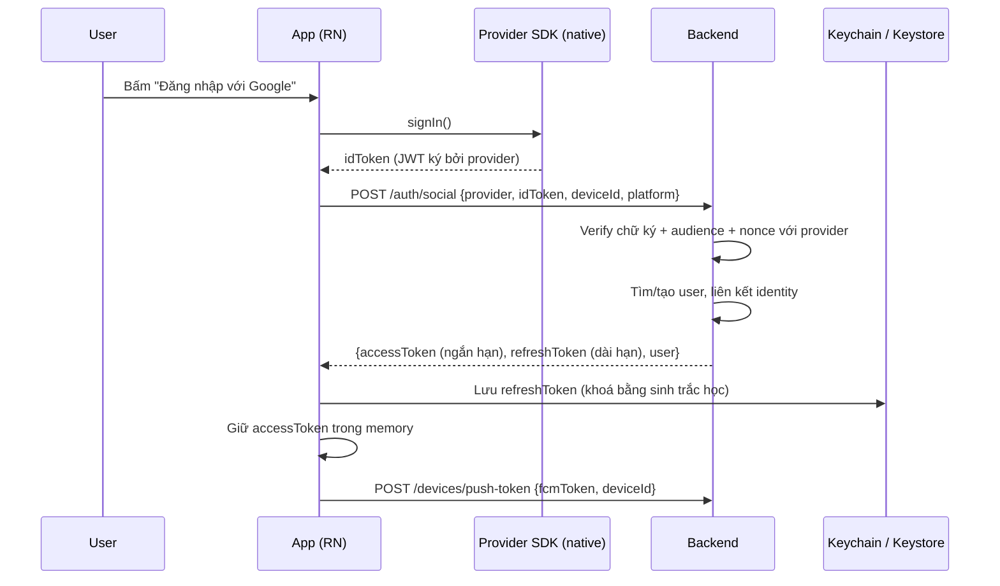
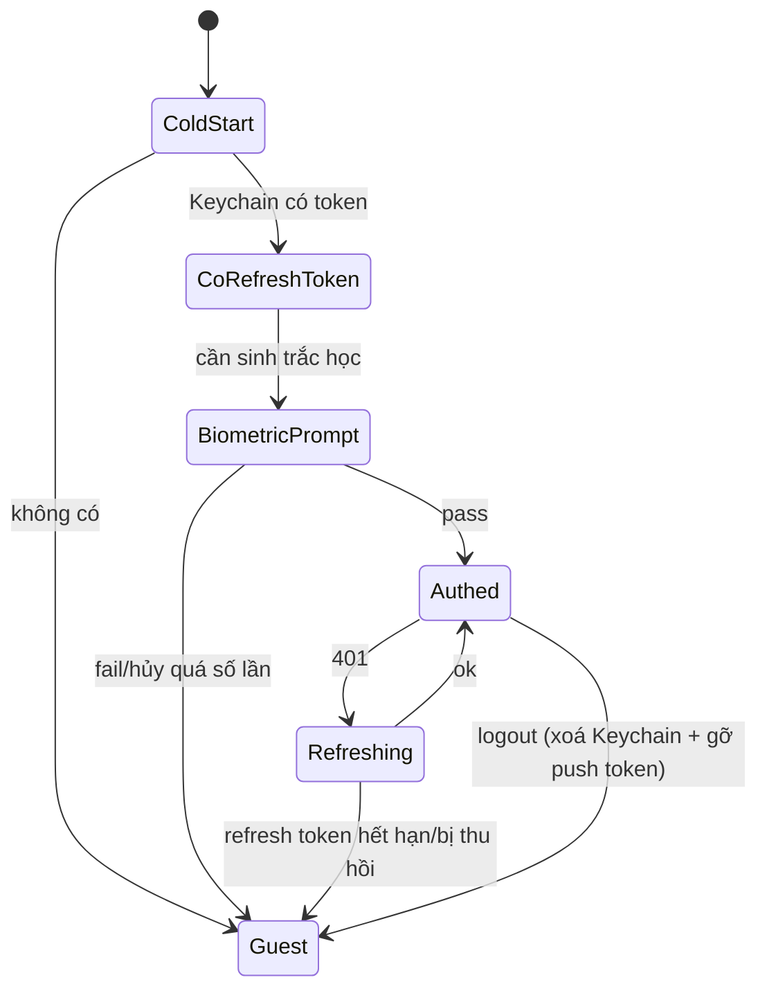
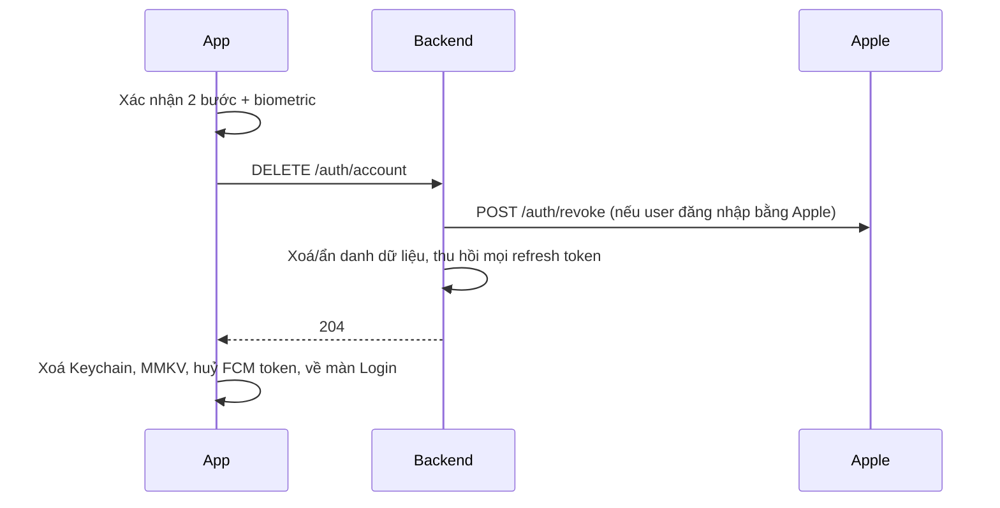

# 02 – Login native: Google · Facebook · Apple · Biometric

> Phân tích luồng nghiệp vụ, kiến trúc token, phần nào phải đụng native, và các bẫy review store.

---

## 1. Nguyên tắc kiến trúc: **Provider chỉ chứng minh danh tính, Backend mới cấp phiên**

Sai lầm phổ biến: coi access token của Google/Facebook là token đăng nhập của app. Hệ quả: không revoke được, không kiểm soát được hạn, không gắn được quyền.



**Chuẩn hoá bằng interface chung** để 4 provider không làm bẩn UI:

```ts
type SocialResult = {
  provider: 'google' | 'facebook' | 'apple';
  idToken?: string;        // Google, Apple, FB Limited Login
  accessToken?: string;    // FB classic login
  nonce?: string;          // Apple
  profileHint?: { email?: string; fullName?: string }; // chỉ dùng khi provider trả 1 lần duy nhất
};

interface AuthProvider {
  signIn(): Promise<SocialResult>;
  signOut(): Promise<void>;
  revoke?(): Promise<void>;   // bắt buộc có ở Apple
}
```

---

## 2. Vòng đời phiên & lưu trữ token

| Dữ liệu | Nơi lưu | Vì sao |
|---|---|---|
| `accessToken` (5–15 phút) | **Memory** (zustand), tối đa là MMKV | Ngắn hạn, mất là refresh lại được |
| `refreshToken` (dài hạn) | **Keychain (iOS) / Keystore-backed EncryptedSharedPreferences (Android)** qua `react-native-keychain`, có `accessControl` sinh trắc học | Đây là "chìa khoá tài khoản". Không bao giờ để trong MMKV/AsyncStorage |
| `deviceId` | MMKV (uuid sinh lần đầu) | Định danh thiết bị cho push token & multi-device |
| `fcmToken` | Không cần lưu bền, lấy lại mỗi lần khởi động | Có thể bị xoay vòng |

**Refresh phải single-flight**: 5 request 401 cùng lúc chỉ được kích hoạt **1** lần refresh, các request còn lại chờ cùng promise. Không làm việc này = rotate refresh token loạn → user bị đá ra ngoài ngẫu nhiên. Đây là bug kinh điển, phải viết ngay từ đầu ở tầng `src/services`.



---

## 3. Google Sign-In

**Lib:** `@react-native-google-signin/google-signin@16.x`

### Việc phải làm ở console (nhân đôi theo flavor)
- Firebase project dev + prod (hoặc GCP OAuth trực tiếp).
- **Web client ID** (bắt buộc, để lấy `idToken`) – khai vào `configure({ webClientId })`.
- **Android OAuth client** cho mỗi cặp (applicationId × SHA-1). Xem file 01 mục 3.2 điểm 4 – **nhớ SHA của Play App Signing key**.
- **iOS OAuth client** → lấy `REVERSED_CLIENT_ID` bỏ vào `CFBundleURLSchemes` (theo từng flavor).

### Điểm cần lưu ý về version
Từ bản ≥13, Android chuyển sang **Credential Manager**. Hệ quả:
- UI đăng nhập là bottom sheet hệ thống, không phải activity riêng → **không cần** xử lý `onActivityResult`.
- Có thêm luồng **One Tap / sign-in tự động**; nếu user chưa có tài khoản Google trên máy sẽ ném lỗi khác với bản cũ → phải map lại error code.
- Docs bản cũ (v9–v11) **không dùng lại được**. Áp dụng "Nguyên tắc vàng": đọc `node_modules/@react-native-google-signin/google-signin/README.md`.

### Lỗi kinh điển
| Triệu chứng | Nguyên nhân thật |
|---|---|
| `DEVELOPER_ERROR` chỉ khi cài từ Play | Thiếu SHA-1 của **App Signing key** (Play ký lại), chỉ mới khai upload key |
| `idToken = null` | Thiếu `webClientId` hoặc dùng nhầm Android client ID |
| iOS mở Safari rồi không quay lại | Thiếu URL scheme `REVERSED_CLIENT_ID` trong Info.plist của **configuration đang chạy** |

---

## 4. Facebook Login

**Lib:** `react-native-fbsdk-next@13.x`

### Cấu hình theo flavor
- Android: `facebook_app_id`, `facebook_client_token` → **không hardcode trong `strings.xml`**, khai bằng `resValue` trong từng productFlavor hoặc `manifestPlaceholders`.
- Android manifest cần `FacebookActivity`, `CustomTabActivity` + `<queries>` cho package Facebook.
- **Key hash** khai trên Facebook Developer theo từng keystore (debug, upload, Play App Signing).
- iOS: `FacebookAppID`, `FacebookClientToken`, `CFBundleURLSchemes = fb<appid>`, `LSApplicationQueriesSchemes`.

### Native phải tự viết – RN 0.79 dùng `AppDelegate.swift`
Docs Facebook viết cho Objective-C `AppDelegate.m`. Với `AppDelegate.swift` hiện tại phải tự thêm:

```swift
import FBSDKCoreKit

func application(_ application: UIApplication,
                 didFinishLaunchingWithOptions launchOptions: [...]) -> Bool {
  ApplicationDelegate.shared.application(application, didFinishLaunchingWithOptions: launchOptions)
  // ... phần RCTReactNativeFactory hiện có
}

func application(_ app: UIApplication, open url: URL,
                 options: [UIApplication.OpenURLOptionsKey : Any] = [:]) -> Bool {
  return ApplicationDelegate.shared.application(app, open: url, options: options)
}
```

> Đây là chỗ **duy nhất** trong 4 provider bắt buộc sửa `AppDelegate.swift`. Nếu sau này thêm deep link (Universal Links / notification tap) thì `openURL` phải **chain** nhiều handler chứ không `return` sớm ở Facebook.

### Nghiệp vụ cần biết
- **Limited Login (iOS)**: nếu không xin ATT, Facebook trả **JWT OIDC** thay vì access token → BE phải verify JWT, **không** gọi Graph API được. Phải chốt với BE hỗ trợ cả 2 dạng.
- Facebook có thể **không trả email** (user đăng ký bằng số điện thoại, hoặc từ chối quyền) → luồng đăng ký phải chịu được trường hợp thiếu email.
- Muốn app duyệt public: cần **Data Deletion Callback URL** + hoàn tất App Review cho `public_profile`/`email`.

---

## 5. Sign in with Apple

**Lib:** `@invertase/react-native-apple-authentication@2.x`

### Bắt buộc về mặt pháp lý/store
- **App Store Guideline 4.8**: nếu app có login bên thứ ba (Google/Facebook) thì **phải** có Sign in with Apple hoặc một phương thức tương đương về quyền riêng tư. Không có = reject.
- **Guideline 5.1.1(v)**: app cho tạo tài khoản thì phải cho **xoá tài khoản trong app**, và với Apple phải **revoke token** khi xoá.

### Bẫy lớn nhất: dữ liệu chỉ trả về **một lần**
`fullName` và `email` chỉ có ở **lần authorize đầu tiên** của user với App ID đó. Lần sau chỉ có `user id` + `identityToken`.

→ **Nghiệp vụ bắt buộc:** gửi `fullName`/`email` lên BE **ngay trong request đầu tiên**; nếu request đó fail (mất mạng) thì coi như mất tên vĩnh viễn (trừ khi user vào Settings gỡ app khỏi Apple ID). Phải retry/queue request này.

Thêm nữa: user có thể chọn **Hide My Email** → email nhận được là `xxx@privaterelay.appleid.com`. BE phải chấp nhận, và nếu app gửi email cho user thì phải đăng ký domain relay với Apple.

### Nonce
Sinh `rawNonce` random → gửi `sha256(rawNonce)` cho Apple → gửi `rawNonce` + `identityToken` lên BE → BE so khớp claim `nonce`. Chống replay. Không được bỏ qua.

### Android
Nếu prod cần Apple login trên Android: dùng `appleAuthAndroid` (web flow) – cần **Service ID** + **Return URL** trỏ về BE. Cân nhắc: nếu user Android hầu như không dùng Apple ID thì có thể bỏ, guideline 4.8 chỉ áp dụng cho App Store.

---

## 6. Biometric – phân tích 3 mức, chọn mức nào

Đây là phần hay bị làm sai nhất: nhiều app chỉ hiện prompt vân tay rồi `if (success) navigate('Home')` — **hoàn toàn vô nghĩa về bảo mật**, chỉ cần patch JS bundle hoặc dựng lại state là qua.

| Mức | Cách làm | Chống được gì | Dùng khi nào |
|---|---|---|---|
| **1 – Cổng UI** | `simplePrompt()` → nếu ok thì cho vào | Người nhà cầm máy xem trộm | Chỉ đủ cho app nội dung, không có tiền/dữ liệu nhạy cảm |
| **2 – Mở khoá secret** ✅ khuyến nghị | `refreshToken` lưu trong Keychain với `accessControl: BIOMETRY_CURRENT_SET` / Android `setUserAuthenticationRequired(true)`. Không pass sinh trắc học thì **OS không trả ra bytes** | Kẻ tấn công có máy đã unlock, app bị hook JS | Mặc định cho app có tài khoản |
| **3 – Ký số challenge** | `react-native-biometrics`: tạo cặp khoá trong Secure Enclave/TEE, BE gửi challenge, app ký, BE verify chữ ký | Replay, giả mạo client, chối bỏ giao dịch | Xác nhận giao dịch, đổi mật khẩu, thao tác tiền |

**Chốt cho Mapper: mức 2 + mức 3 đều bắt buộc** (đã xác nhận có nghiệp vụ xác nhận giao dịch bằng vân tay). Hai cơ chế dùng **hai cặp khoá riêng biệt** – chi tiết luồng ký số, nội dung challenge và các bẫy ở [05-CHOT-QUYET-DINH.md](./05-CHOT-QUYET-DINH.md) mục 6.

### Các tình huống nghiệp vụ phải xử lý (checklist)

- [ ] Thiết bị **không có** cảm biến / chưa đăng ký vân tay → phải có đường đăng nhập lại bằng provider, không được kẹt.
- [ ] User **thêm/xoá vân tay** sau khi đã lưu token: với `BIOMETRY_CURRENT_SET` (iOS) và `invalidatedByBiometricEnrollment` (Android), khoá bị **huỷ** → đọc Keychain ném lỗi → phải bắt lỗi này và **ép đăng nhập lại**, không hiện "lỗi hệ thống".
- [ ] Sai quá số lần → OS lockout tạm thời (30s) hoặc vĩnh viễn tới khi nhập passcode → thông báo đúng, cho fallback passcode thiết bị (`DEVICE_PASSCODE`).
- [ ] User tắt biometric trong app → phải **xoá refresh token khỏi Keychain** và chuyển sang yêu cầu đăng nhập lại mỗi phiên (không được hạ cấp xuống lưu plaintext).
- [ ] iOS: `NSFaceIDUsageDescription` trong Info.plist, nếu thiếu app **crash** khi gọi Face ID.
- [ ] Android: `USE_BIOMETRIC` permission; máy Trung Quốc (MIUI/EMUI) có hành vi prompt khác → cần test thật.
- [ ] Đổi thiết bị / khôi phục backup: Keychain iOS có thể theo iCloud backup → phải đặt `accessible: WHEN_UNLOCKED_THIS_DEVICE_ONLY` để token không đi theo backup.

---

## 7. Khi nào phải tự viết native module (New Arch)

Với 4 provider ở trên: **không cần** viết module riêng, các lib đã hỗ trợ. Chỉ cần native module tự viết khi:

| Trường hợp | Giải pháp |
|---|---|
| Ghi dữ liệu vào App Group cho Widget iOS | Native module nhỏ (xem file 04) |
| Đọc build info (env, versionName, buildNumber, gitSha) cho màn About | Có thể lấy từ `react-native-config`/`BuildConfig`; nếu không thì 1 module 10 dòng |
| SDK bên thứ ba (eKYC, cổng thanh toán nội địa) không có wrapper RN | Viết **Turbo Module** (codegen) hoặc **Nitro Module** – project đã có `react-native-nitro-modules` nên Nitro là lựa chọn nhất quán, ít boilerplate hơn |

Vì `newArchEnabled=true`, **không** dùng `NativeModules` kiểu cũ cho code mới (bridge legacy vẫn chạy qua interop nhưng sẽ bị loại bỏ).

---

## 8. Xoá tài khoản (bắt buộc cho cả 2 store)



Thiếu bước `revoke` với Apple → **reject khi review**. BE cần lưu `refresh_token` do Apple cấp lúc đăng nhập lần đầu để có thể revoke sau này.

---

## 9. Checklist nghiệm thu Phase 1

- [ ] 3 provider chạy được trên **cả 4 variant** (dev/prod × debug/release) – đặc biệt release ký bằng upload key.
- [ ] Bản cài từ Play Internal testing đăng nhập Google được (kiểm chứng SHA App Signing).
- [ ] Kill app → mở lại → chỉ cần vân tay, không phải đăng nhập lại.
- [ ] Thêm 1 vân tay mới → app yêu cầu đăng nhập lại (không crash, không lỗi lạ).
- [ ] Logout xoá sạch Keychain + gỡ push token khỏi BE.
- [ ] 5 API 401 đồng thời chỉ sinh **1** lần refresh.
- [ ] Apple: lần đầu lưu được tên; lần hai không ghi đè tên bằng `null`.
- [ ] Có màn "Xoá tài khoản" hoạt động thật.
