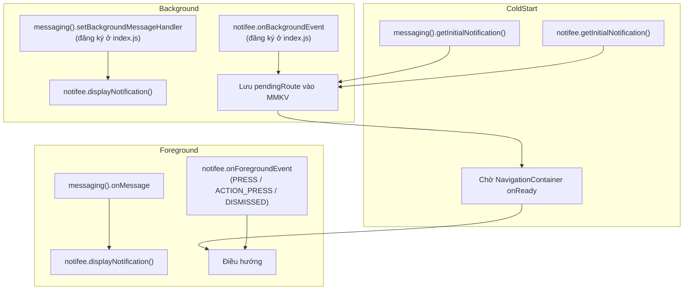
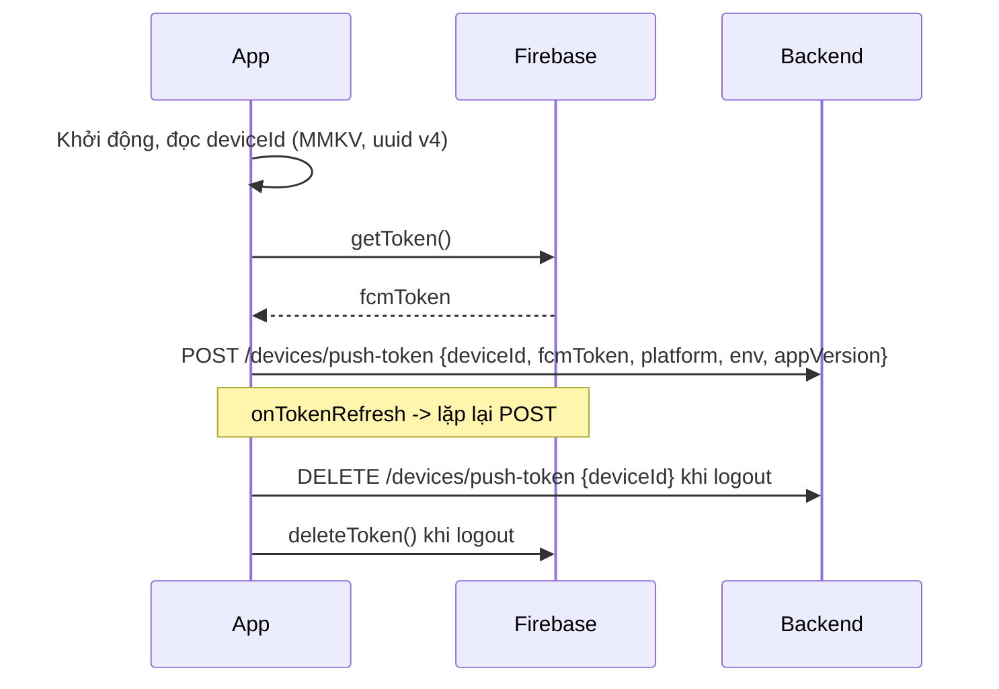

# 03 – FCM + Local Notification (Notifee)

> Phân tích luồng xử lý thông báo đầy đủ: quyền, token, 3 trạng thái app, hiển thị, deep link, lịch local.

---

## 1. Phân vai: FCM ≠ Notifee

| | Vai trò | Không làm gì |
|---|---|---|
| **`@react-native-firebase/messaging`** | Vận chuyển: đăng ký token, nhận message từ FCM/APNs, gọi handler | Không kiểm soát được giao diện notification hệ thống hiển thị |
| **`@notifee/react-native`** | Hiển thị & tương tác: channel, importance, style (BigText/BigPicture), nút hành động, badge, **lịch local (trigger)** | Không nhận được message từ server |

→ Hai lib **bổ sung** cho nhau. Kiến trúc: FCM nhận → code JS quyết định → Notifee hiển thị.

---

## 2. Quyết định quan trọng nhất: **payload phải khác nhau giữa Android và iOS**

Đây là điểm nhiều team làm sai và dẫn tới "thông báo bị nhân đôi" hoặc "không nhận được khi tắt app".

| Trạng thái app | Payload có key `notification` | Payload **data-only** |
|---|---|---|
| **Android** foreground | FCM **không** hiện; `onMessage` chạy → ta tự hiện bằng Notifee | `onMessage` chạy → ta tự hiện |
| **Android** background/quit | **Hệ thống tự hiện** (không style được, không qua Notifee), `onMessage` không chạy | `setBackgroundMessageHandler` chạy → **ta toàn quyền hiển thị** ✅ |
| **iOS** foreground | `onMessage` chạy → tự hiện bằng Notifee | `onMessage` chạy |
| **iOS** background/quit | APNs hiện alert (đảm bảo giao) ✅ | Silent push: **không hiện gì**, bị hệ thống throttle, **không đảm bảo giao**, app bị force-quit thì không chạy |

### Kết luận (contract chốt với BE)

```jsonc
// FCM v1 API
{
  "message": {
    "token": "<device token>",
    "data": {                         // luôn có, dùng cho routing & render
      "type": "ORDER_UPDATED",
      "entityId": "12345",
      "title": "Đơn hàng đã được xác nhận",
      "body": "Đơn #12345 sẽ giao trong hôm nay",
      "deeplink": "mapper://orders/12345",
      "channelId": "order",
      "imageUrl": "https://..."
    },
    "android": {
      "priority": "high"
      // ❗ KHÔNG có "notification" -> data-only -> Notifee toàn quyền
    },
    "apns": {
      "headers": { "apns-priority": "10", "apns-push-type": "alert" },
      "payload": {
        "aps": {
          "alert": { "title": "...", "body": "..." },   // ❗ iOS BẮT BUỘC có
          "sound": "default",
          "badge": 3,
          "mutable-content": 1        // nếu cần Notification Service Extension để tải ảnh
        }
      }
    }
  }
}
```

**Quy tắc:** `data` là **nguồn sự thật** cho logic app; `aps.alert` chỉ để iOS hiển thị khi app không chạy. Mọi field trong `data` phải là **string** (giới hạn của FCM).

Giới hạn kích thước payload: **4KB**. Không nhét nội dung dài/ảnh base64 → chỉ đưa `id` + `url`.

---

## 3. Luồng đầy đủ theo trạng thái app



### Vị trí đăng ký handler – **rất dễ sai**

`setBackgroundMessageHandler` và `notifee.onBackgroundEvent` chạy trong **headless JS**, ngoài cây React. Phải đăng ký ở **`index.js`, trước `AppRegistry.registerComponent`**:

```js
// index.js
import { AppRegistry } from 'react-native';
import messaging from '@react-native-firebase/messaging';
import notifee, { EventType } from '@notifee/react-native';
import App from './App';
import { name as appName } from './app.json';
import { displayFromPayload, setPendingRoute } from './src/services/notification';

messaging().setBackgroundMessageHandler(async (msg) => {
  await displayFromPayload(msg.data);   // Android: chính chỗ này mới hiện notification
});

notifee.onBackgroundEvent(async ({ type, detail }) => {
  if (type === EventType.PRESS) {
    setPendingRoute(detail.notification?.data?.deeplink);   // ghi MMKV, KHÔNG navigate ở đây
  }
});

AppRegistry.registerComponent(appName, () => App);
```

> Không được `navigate()` trong background handler – lúc đó `NavigationContainer` chưa tồn tại. Phải qua hàng đợi `pendingRoute` + `navigationRef` khi `onReady`.

---

## 4. Quyền thông báo (permission)

| Nền tảng | Yêu cầu | Thời điểm xin |
|---|---|---|
| Android ≤ 12 | Không cần | – |
| **Android 13+** | Runtime permission `POST_NOTIFICATIONS` (khai trong Manifest + `notifee.requestPermission()`) | **Không** xin lúc mở app lần đầu. Xin **đúng lúc có ngữ cảnh** (sau khi user tạo đơn / bật nhắc lịch) → tỉ lệ đồng ý cao hơn nhiều. Bị từ chối 2 lần là Android khoá vĩnh viễn, chỉ mở lại trong Settings |
| **iOS** | `messaging().requestPermission()` / `notifee.requestPermission()` | Cân nhắc **provisional authorization** (`provisional: true`): thông báo vào Notification Center im lặng, không cần hỏi – dùng cho thông báo không khẩn |

**Nghiệp vụ bắt buộc:** khi user đã từ chối, app phải có **màn hình In-app Inbox** để không mất thông tin, và nút "Mở cài đặt" (`notifee.openNotificationSettings()`).

---

## 5. Vòng đời FCM token



Điểm nghiệp vụ:

- Gắn token theo **`deviceId`**, không theo user → logout ở máy A không xoá nhầm máy B.
- **Logout phải gỡ token**, nếu không user B đăng nhập trên máy đó vẫn nhận push của user A → sự cố lộ dữ liệu.
- iOS: cần APNs key (.p8) upload lên Firebase; **entitlement `aps-environment` phải khớp môi trường** (xem file 01 mục 4.4). Sai = `getToken()` ném lỗi hoặc token vô dụng.
- 2 Firebase project dev/prod → token dev **không** bắn được từ prod, đúng như mong muốn.
- BE nên dọn token chết khi FCM trả `UNREGISTERED`.

---

## 6. Notifee – cấu hình hiển thị

### 6.1 Channel (Android) – tạo trước khi hiển thị

Channel là **bất biến sau khi tạo**: đổi importance/âm thanh của channel cũ **không có tác dụng**, phải tạo channel id mới. → Đặt tên id có version: `order_v1`, `promo_v1`.

Đề xuất tách channel theo nghiệp vụ để user tắt riêng từng loại:

| channelId | Tên hiển thị | Importance |
|---|---|---|
| `transaction_v1` | Giao dịch / đơn hàng | HIGH (heads-up) |
| `reminder_v1` | Nhắc lịch | DEFAULT |
| `promo_v1` | Khuyến mãi | LOW |
| `system_v1` | Hệ thống | DEFAULT |

### 6.2 Các thiết lập bắt buộc

- `smallIcon` (Android): phải là icon **trắng trên nền trong suốt**, nếu dùng icon màu sẽ ra ô vuông xám. + `color` cho tint.
- `pressAction: { id: 'default', launchActivity: 'default' }` – **bắt buộc** vì Android 12+ cấm *notification trampoline* (tap → broadcast/service → mở activity). Phải mở activity trực tiếp.
- `android.style` BigPicture khi có `imageUrl`; iOS muốn hiện ảnh phải có **Notification Service Extension** + `mutable-content: 1`.
- `ios.badgeCount` / `notifee.setBadgeCount()` – quy ước ai giảm badge (thường: khi mở In-app Inbox thì set 0).
- Nút hành động (`actions`) → xử lý trong cả `onForegroundEvent` lẫn `onBackgroundEvent`.

### 6.3 Local notification có lịch (trigger)

Dùng cho nhắc việc, nhắc lịch, đếm ngược.

| Vấn đề | Xử lý |
|---|---|
| Android 12+ báo thức chính xác | `TimestampTrigger` + `alarmManager: { allowWhileIdle: true }` cần `SCHEDULE_EXACT_ALARM`/`USE_EXACT_ALARM`. **Play Store kiểm duyệt chặt** quyền này – chỉ xin nếu thật sự là app báo thức/lịch; còn lại chấp nhận sai số vài phút |
| Doze / battery optimization | Thiết bị Xiaomi/Oppo/Vivo kill app rất mạnh → notification theo lịch có thể không nổ. Phải có hướng dẫn user bật "Auto start" + đồng thời **backup bằng push server-side** cho nhắc việc quan trọng |
| Reboot máy | Notifee tự lên lịch lại nếu khai `RECEIVE_BOOT_COMPLETED`; cần verify theo version |
| iOS giới hạn 64 notification pending | Không lên lịch hàng loạt; chỉ giữ N cái gần nhất, rolling khi mở app |

---

## 7. Deep link từ notification

```ts
// src/services/notification/pending.ts
let pending: string | null = null;
export const setPendingRoute = (url?: string) => { if (url) storage.set('pendingRoute', url); };

// AppNavigator: onReady
const url = storage.getString('pendingRoute');
if (url) { storage.delete('pendingRoute'); navigationRef.navigate(parse(url)); }
```

Quy tắc:
1. **Mọi** notification đều có `deeplink` dạng `mapper://<route>/<id>` – kể cả loại chỉ mở Home.
2. Nếu route cần đăng nhập mà user chưa login → lưu lại, điều hướng sau khi login xong (đây là logic nghiệp vụ dễ quên).
3. Dùng chung 1 parser với Universal Links/App Links để không có 2 bộ luật điều hướng.

---

## 8. Ma trận test bắt buộc (giao QA)

| # | Kịch bản | Android | iOS |
|---|---|---|---|
| 1 | App foreground, nhận push | Hiện heads-up qua Notifee | Hiện banner qua Notifee |
| 2 | App background (đã mở, bấm Home) | Hiện, tap mở đúng màn | Hiện, tap mở đúng màn |
| 3 | App **bị swipe kill** | Vẫn hiện (data-only + priority high) | Vẫn hiện (APNs alert) |
| 4 | Máy tắt nguồn rồi bật lại, chưa mở app | Hiện | Hiện |
| 5 | Tap notification khi app đã kill → **cold start** điều hướng đúng | ✅ | ✅ |
| 6 | Tap nút hành động (không mở app) | ✅ | ✅ |
| 7 | Chưa cấp quyền → không crash, có in-app inbox | ✅ | ✅ |
| 8 | Từ chối quyền rồi vào Settings bật lại | ✅ | ✅ |
| 9 | Logout → không còn nhận push | ✅ | ✅ |
| 10 | Notification theo lịch nổ đúng giờ sau khi app bị kill 6 tiếng | ⚠️ test trên Xiaomi/Oppo | ✅ |
| 11 | Badge tăng/giảm đúng | – | ✅ |
| 12 | Push từ Firebase **dev** không tới bản **prod** và ngược lại | ✅ | ✅ |

---

## 9. Rủi ro & cách phòng

| Rủi ro | Mức | Phòng ngừa |
|---|---|---|
| `@react-native-firebase` v25 nâng min iOS > 15.1 của RN 0.79 | **Cao** | Spike 0.5 ngày: cài + `pod install` + archive thử. Nếu vỡ → nâng `platform :ios` trong Podfile (chấp nhận cắt user iOS cũ) hoặc hạ version RNFirebase |
| Notifee chưa tương thích Kotlin 2.0.21 / New Arch | Trung bình | Spike cùng lúc với trên |
| Push nhân đôi trên Android | Cao nếu BE gửi cả `notification` lẫn data | Enforce contract mục 2, viết test payload ở BE |
| OEM Trung Quốc kill app | Cao | Thông báo quan trọng luôn đi bằng server push, không chỉ local schedule |
| Payload > 4KB | Thấp | Validate ở BE |
| Không có Notification Service Extension mà vẫn hứa "push có ảnh" | Trung bình | Chốt scope sớm, +1 dev-day nếu cần |

---

## 10. Checklist nghiệm thu Phase 2

- [ ] Chạy hết 12 kịch bản ở mục 8 trên **cả 4 variant**.
- [ ] Tài liệu payload contract đã được BE ký nhận và có sample cURL.
- [ ] Channel Android được tạo lúc khởi động, importance đúng.
- [ ] Không còn `console.log` token trong bản release.
- [ ] In-app Inbox hoạt động khi quyền bị từ chối.
- [ ] `deviceId` ổn định qua các lần mở app; logout gỡ token thành công.
