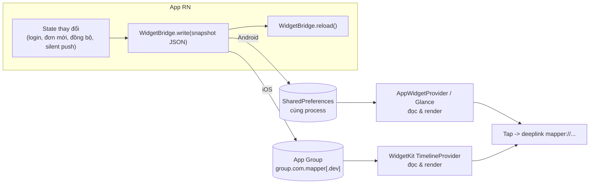

# 04 – Widget màn hình chính (Android AppWidget + iOS WidgetKit)

> Đây là khối **nhiều native nhất** trong 4 khối. Phải hiểu rõ 1 sự thật trước khi thiết kế.

---

## 1. Sự thật nền tảng: **React Native không chạy trong widget**

| | Android | iOS |
|---|---|---|
| Widget chạy ở đâu | Process của **Launcher**, UI dựng bằng `RemoteViews` (hoặc Jetpack **Glance**) | **Extension process riêng**, UI **bắt buộc SwiftUI** (WidgetKit) |
| Có chạy được JS không | Chỉ gián tiếp qua **Headless JS** để *tính* dữ liệu, không render trực tiếp | **Không**. Tuyệt đối không có JS |
| Giới hạn UI | Chỉ tập con View được phép, không custom view | Chỉ tập con SwiftUI, không animation, không scroll |
| Cập nhật | AppWidgetManager, tối thiểu 30 phút nếu dùng `updatePeriodMillis` | Timeline + **budget hệ thống** (~40–70 lần refresh/ngày, iOS tự quyết) |

> ⚠️ Yêu cầu đã chốt là **làm mới mỗi 5 phút** và **bắt buộc login mới dùng được widget**. Cả hai điểm này đụng giới hạn hệ điều hành và cần thiết kế riêng — đọc [05-CHOT-QUYET-DINH.md](./05-CHOT-QUYET-DINH.md) mục 4 và mục 5 **trước khi** triển khai phần này.

→ **Widget không phải là "một màn hình RN thu nhỏ".** Nó là một app nhỏ độc lập, chỉ **đọc dữ liệu do app chính ghi sẵn**.

---

## 2. Kiến trúc đề xuất: **Snapshot do app ghi**



**So sánh 2 phương án:**

| | A. App ghi snapshot ✅ | B. Widget tự gọi API |
|---|---|---|
| Độ phức tạp | Thấp – widget chỉ render | Cao – phải làm networking + auth trong Swift/Kotlin |
| Auth | Không cần token trong widget | Phải chia sẻ token qua Keychain Access Group / EncryptedSharedPreferences → **tăng bề mặt tấn công** |
| Độ tươi dữ liệu | Chỉ mới bằng lần cuối app chạy… | …trừ khi kết hợp **silent push** đánh thức app |
| Tốn budget refresh iOS | Ít | Nhiều |

→ **Chốt phương án A cho bản đầu.** Nếu cần dữ liệu tươi khi app không mở: dùng **silent push** (`content-available: 1`) → `setBackgroundMessageHandler` chạy → ghi snapshot → gọi reload. Đây chính là điểm giao giữa khối Notification và khối Widget (làm Notification trước là vì vậy).

**Snapshot contract** (dùng chung 2 nền tảng, versioned):

```jsonc
{
  "v": 1,
  "updatedAt": "2026-07-27T10:00:00Z",
  "isLoggedIn": true,
  "items": [
    { "id": "12345", "title": "Đơn #12345", "subtitle": "Đang giao", "deeplink": "mapper://orders/12345" }
  ],
  "emptyText": "Chưa có đơn nào"
}
```

Trường `v` để widget cũ (chưa cập nhật cùng lúc với app) không crash khi format đổi.

---

## 3. Android

### Lựa chọn triển khai

| | `react-native-android-widget@0.21` | Native Glance/RemoteViews thuần |
|---|---|---|
| Cách viết UI | JSX (`<FlexWidget>`, `<TextWidget>`) render ra RemoteViews | Kotlin + Glance Compose |
| Ưu | Team RN tự làm được, chia sẻ logic/format với app | Toàn quyền, không phụ thuộc lib bên thứ ba, hiệu năng tốt hơn |
| Nhược | Phụ thuộc lib còn ở `0.x` (API có thể đổi), cần headless JS mỗi lần update → tốn pin hơn | Cần người biết Kotlin/Compose |
| Khi nào chọn | Widget đơn giản, team không có Android dev | Widget nhiều, cập nhật thường xuyên, cần chuẩn hoá lâu dài |

**Đề xuất:** nếu widget ≤ 2 loại và chỉ hiển thị danh sách ngắn → dùng `react-native-android-widget` cho nhanh; ghi rõ đây là **quyết định có thể phải đảo** khi widget phức tạp lên.

### Việc phải làm dù chọn cách nào

- `AndroidManifest.xml`: khai `<receiver>` `AppWidgetProvider` + `<meta-data>` trỏ `appwidget-info.xml` (kích thước tối thiểu, `resizeMode`, `updatePeriodMillis`, preview image).
- **Android 12+**: widget phải có bo góc theo `system_app_widget_background_radius`, hỗ trợ dynamic color (Material You) nếu muốn nhìn "chuẩn".
- **Tap**: `PendingIntent` mở `MainActivity` kèm `data = Uri` → RN đọc bằng `Linking.getInitialURL()`. **`PendingIntent` phải có `FLAG_IMMUTABLE`** (bắt buộc từ Android 12, thiếu là crash).
- **Flavor**: receiver nằm ở `src/main` dùng chung, nhưng preview/tên widget nên khác nhau giữa dev/prod để QA phân biệt (`resValue`/res theo flavor).

---

## 4. iOS

Không có lib RN nào làm thay. Các bước bắt buộc:

1. **Tạo Widget Extension target** trong Xcode (`MapperWidget`) – Swift + WidgetKit.
2. **App Group**: bật capability cho **cả** app target và widget target: `group.com.mapper` (prod) / `group.com.mapper.dev` (dev). Vì bundle id khác nhau theo flavor → **2 App Group**, gán qua 2 file `.entitlements` theo configuration (xem file 01 mục 4.4).
3. **Widget bundle id** phải là con của app: `com.mapper.dev.widget` cho flavor dev → dùng `$(PRODUCT_BUNDLE_IDENTIFIER)` kế thừa từ xcconfig để không hardcode.
4. **Native module ghi dữ liệu** (app → App Group). Vì project đã có `react-native-nitro-modules`, nên viết bằng Nitro cho nhất quán New Arch:

```swift
// Đọc/ghi trong UserDefaults(suiteName:) + gọi reload
UserDefaults(suiteName: appGroup)?.set(jsonString, forKey: "widget_snapshot")
WidgetCenter.shared.reloadTimelines(ofKind: "MapperWidget")
```

5. **TimelineProvider**: đọc snapshot, trả timeline. Chính sách refresh nên là `.after(Date+15p)` hoặc `.never` (chỉ reload khi app gọi) — `.never` tiết kiệm budget nhất, phù hợp phương án A.
6. **Deep link**: `Link(destination: URL(string: item.deeplink))` hoặc `.widgetURL(...)`. RN nhận qua `Linking`.
7. **Kích thước**: `systemSmall`, `systemMedium`, `systemLarge` + lock screen (`accessoryRectangular`, `accessoryCircular`) nếu cần.
8. **Interactive widget (iOS 17+)**: nút bấm trong widget qua `AppIntent` – **chỉ Swift**, không gọi được JS. Nếu nghiệp vụ cần "đánh dấu xong" ngay trên widget thì AppIntent phải tự ghi vào App Group và app đọc lại khi mở → cần thiết kế đồng bộ 2 chiều, tăng đáng kể độ phức tạp. **Bản đầu nên bỏ qua.**

### Phân biệt với Live Activity
Live Activity / Dynamic Island là **ActivityKit**, không phải WidgetKit widget (dù cùng dùng SwiftUI). Nếu có nghiệp vụ theo dõi tiến trình realtime (giao hàng, di chuyển) thì đó là hạng mục **riêng**, ước lượng thêm 3–4 dev-day, và cần push token riêng cho từng activity.

---

## 5. Tác động chéo tới các phase khác

| Khối | Ảnh hưởng |
|---|---|
| **Flavor (01)** | App Group, widget bundle id, entitlements đều nhân đôi. Đây là lý do widget phải làm **sau** flavor |
| **Auth (02)** | Widget phải xử lý trạng thái chưa đăng nhập: hiện CTA "Đăng nhập" + deeplink, **không** hiện dữ liệu cũ của user trước. Logout ⇒ **phải xoá snapshot + reload widget**, nếu quên là lộ dữ liệu người dùng trước trên màn hình chính |
| **Notification (03)** | Silent push là cơ chế duy nhất làm tươi widget khi app không chạy |

---

## 6. Checklist nghiệm thu Phase 3

- [ ] Thêm widget từ launcher/màn hình chính trên cả 2 nền tảng, cả 2 flavor.
- [ ] Widget dev và widget prod hiển thị dữ liệu riêng (không lẫn App Group).
- [ ] Đổi dữ liệu trong app → widget cập nhật trong vài giây.
- [ ] Silent push khi app đã kill → widget cập nhật.
- [ ] Tap widget → mở đúng màn hình, kể cả khi app chưa chạy (cold start).
- [ ] Logout → widget về trạng thái "chưa đăng nhập", không còn dữ liệu cũ.
- [ ] Widget không crash khi snapshot rỗng / sai version / app vừa cài xong chưa mở lần nào.
- [ ] Dark mode + Material You / màu hệ thống hiển thị đúng.
