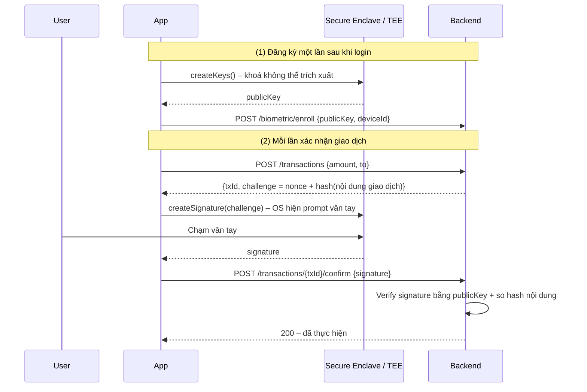
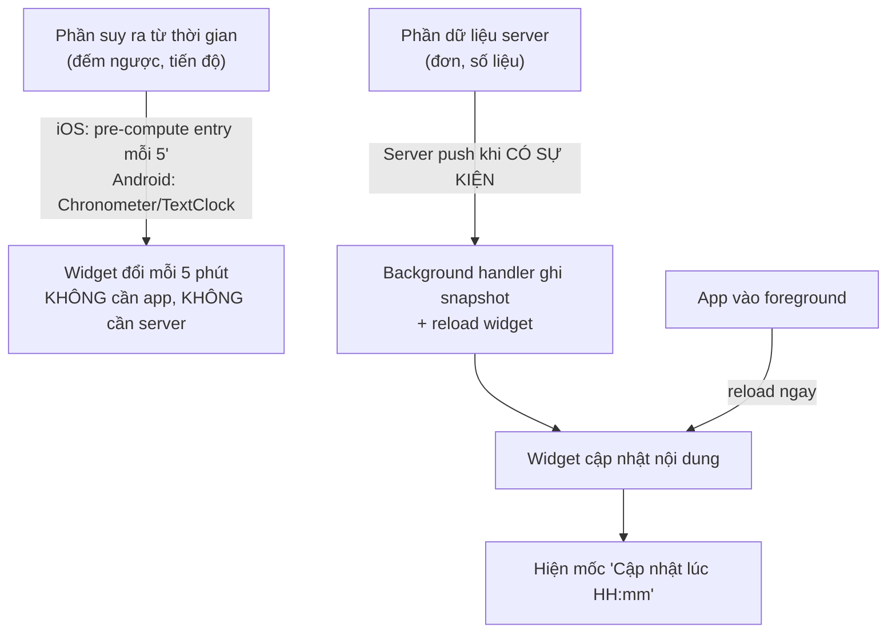

# 05 – Chốt quyết định & phân tích lại phần bị ảnh hưởng

> Ghi nhận câu trả lời cho 8 câu hỏi ở `00-TONG-QUAN.md` mục 6, và **phân tích lại** những chỗ mà câu trả lời làm thay đổi khuyến nghị ban đầu.

---

## 1. Bảng chốt

| # | Câu hỏi | Chốt | Ảnh hưởng |
|---|---|---|---|
| 1 | Firebase | **2 project riêng** dev / prod | Như đã phân tích, không đổi gì |
| 2 | Apple Dev + Play Console | Đã có kinh nghiệm, tự xử lý | Bỏ phần hướng dẫn console khỏi scope |
| 3 | CI | **Không có CI.** Trước nay nâng build number bằng cách sửa tay trong Android + Xcode | ⚠️ **Thay đổi lớn** – mục 3 |
| 4 | Flavor kiểu Flutter | **Tạo app riêng trên store cho từng flavor**, đẩy lên riêng | Giữ nguyên cách này – mục 2 |
| 5 | Login | **Bắt buộc login.** Chưa login **không được kéo widget** | Mục 5 |
| 6 | Widget refresh | **5 phút/lần**, là **hằng số đổi được theo bản build** | ⚠️ **Thay đổi lớn** – mục 4 |
| 7 | Vân tay | **Có nghiệp vụ xác nhận bằng vân tay** | Nâng lên **Biometric mức 3** – mục 6 |
| 8 | Kênh phát hành nội bộ | **TestFlight (iOS) + Internal testing (Android)** | ⚠️ **Thay đổi lớn** – mục 3 |

---

## 2. Mô hình "mỗi flavor là một app riêng trên store"

Cách bạn đang làm ở Flutter **dùng lại nguyên vẹn** cho RN, và nó khớp đúng với mô hình `applicationId`/`bundleId` khác nhau đã đề xuất ở file 01.

| | App DEV | App PROD |
|---|---|---|
| Android package | `com.mapper.dev` | `com.mapper` |
| iOS bundle id | `com.mapper.dev` | `com.mapper` |
| Play Console | App record riêng, **chỉ dùng track Internal testing**, không bao giờ lên Production | App record chính |
| App Store Connect | App record riêng, **chỉ dùng TestFlight**, để mãi ở trạng thái "Prepare for Submission", không submit review | App record chính |
| Firebase | project `mapper-dev` | project `mapper-prod` |
| Widget iOS bundle id | `com.mapper.dev.widget` | `com.mapper.widget` |
| App Group | `group.com.mapper.dev` | `group.com.mapper` |

**Ưu điểm quan trọng:** hai app record có **không gian version/build number độc lập** → bản dev bắn liên tục không làm "cháy" số build của app prod.

**Những điểm cần lưu ý với mô hình này (từ kinh nghiệm thực tế):**

1. **TestFlight Internal testing** không cần Beta App Review, build dùng được ngay sau khi Apple xử lý xong (~5–20 phút). Chỉ **External testing** mới phải chờ duyệt. → App dev chỉ dùng Internal là đủ.
2. Mỗi build upload lên ASC đều bị hỏi **Export Compliance**. Thêm vào `Info.plist` để khỏi phải bấm tay mỗi lần:
   ```xml
   <key>ITSAppUsesNonExemptEncryption</key>
   <false/>
   ```
3. App record DEV vẫn phải điền được **App Icon 1024** và thông tin tối thiểu để build hiện lên TestFlight — nhưng **không cần** screenshot/mô tả vì không submit.
4. Play Internal testing lên bản trong vài phút, tối đa 100 tester. **Cần kiểm tra:** nếu tài khoản Play là **cá nhân mở sau 11/2023**, Google bắt buộc closed testing 12 tester × 14 ngày **trước khi** được mở Production — điều này áp cho **app prod**, nên phải tính vào lịch phát hành lần đầu.
5. Bundle id của app dev **không thể đổi** sau khi tạo record → đặt tên chuẩn ngay từ đầu (`com.mapper.dev`, đừng `com.mapper.debug` rồi lại đổi ý).

---

## 3. ⚠️ Phân tích lại: **không còn được ghi đè build number ở bất kỳ đâu**

Ở file 01 tôi nói "kênh nội bộ ghi đè thoải mái". **Điều đó chỉ đúng khi kênh nội bộ là Firebase App Distribution / gửi APK tay.** Bạn chọn **TestFlight + Play Internal testing** — cả hai đều là kênh chính thức của store, và cả hai đều **từ chối build trùng số**:

| Kênh | Luật |
|---|---|
| TestFlight | Cặp (`CFBundleShortVersionString`, `CFBundleVersion`) phải **duy nhất**. Upload trùng → bị từ chối ngay lúc xử lý, mất 15 phút mới biết |
| Play Internal testing | `versionCode` phải **lớn hơn** mọi bản đã từng upload cho app đó, kể cả bản đã archive |

→ **Kết luận: thói quen "ghi đè version build" phải bỏ hoàn toàn.** Mỗi lần đưa bản cho QA là một build number mới, kể cả khi code chỉ sửa 1 dòng.

### Giải pháp không cần CI: 1 lệnh thay cho việc sửa tay 2 chỗ

Vấn đề thật của bạn không phải "phải tăng số", mà là **phải sửa 2 nơi (Gradle + Xcode) và dễ quên/lệch**. Cách xử lý:

**Nguồn sự thật duy nhất = `package.json`:**

```json
{
  "version": "1.2.3",
  "buildNumber": 45
}
```

- **Android**: `build.gradle` đọc trực tiếp bằng `JsonSlurper` (đã có snippet ở file 01 mục 3.1) → **không bao giờ phải mở Gradle ra sửa số nữa**.
- **iOS**: `scripts/bump.js` ghi ra `ios/Config/Version.xcconfig`:
  ```
  MARKETING_VERSION = 1.2.3
  CURRENT_PROJECT_VERSION = 45
  ```
  → **không bao giờ phải mở Xcode ra sửa số nữa**.

**Lệnh dùng hằng ngày:**

```json
{
  "scripts": {
    "bump":       "node scripts/bump.js build",        // 45 -> 46, giữ nguyên 1.2.3
    "bump:patch": "node scripts/bump.js patch",        // 1.2.3 -> 1.2.4, build +1
    "bump:minor": "node scripts/bump.js minor",        // 1.2.3 -> 1.3.0, build +1
    "version:print": "node scripts/bump.js print"      // in ra để dán vào release note
  }
}
```

`scripts/bump.js` làm đúng 3 việc: sửa `package.json` → ghi `ios/Config/Version.xcconfig` → in `1.2.3 (46)`.
Android không cần đụng vì Gradle đọc thẳng file. Xcode không cần đụng vì đọc xcconfig.

**Quy ước dùng chung 1 counter cho cả dev/prod/iOS/Android** (dù store cho phép độc lập): cùng một số build ⇒ cùng một commit trên cả 4 gói. Số bị nhảy cách (dev đốt số 46, 47 thì prod đi tiếp từ 48) — **hoàn toàn hợp lệ**, chỉ cần tăng dần.

**Quy trình phát hành thủ công (thay cho CI):**

```
1. yarn bump                     # hoặc bump:patch nếu là bản release
2. git commit -am "build 46" && git tag build-46
3. yarn build:android:dev        # -> AAB -> upload Play Internal (app dev)
4. Xcode: scheme "Mapper Dev" -> Archive -> Distribute -> TestFlight
5. Dán "1.2.3 (46)" + commit sha vào release note cho QA
```

> Về sau nếu muốn tự động: chỉ cần một job chạy `yarn bump` + `fastlane`. Kiến trúc 1-nguồn-sự-thật ở trên đã sẵn sàng cho việc đó, không phải làm lại.

**Bổ sung bắt buộc cho màn About:** hiển thị `env / versionName / buildNumber / git sha`. Không có cái này, QA báo bug mà không biết đang test bản nào — với nhịp build dày như TestFlight thì đây là vấn đề thật, không phải chi tiết cho vui.

---

## 4. ⚠️ Phân tích lại: **widget 5 phút** — mục tiêu khả thi tới đâu

Đây là yêu cầu cần nói thẳng: **cả iOS lẫn Android đều không cho phép widget tự làm mới mỗi 5 phút bằng cách gọi dữ liệu mới.** Đây là giới hạn của hệ điều hành, không phải giới hạn của React Native, và không có thư viện nào lách được.

| Nền tảng | Giới hạn cứng |
|---|---|
| **iOS WidgetKit** | Hệ thống cấp **ngân sách ~40–70 lần reload/ngày** cho widget được xem thường xuyên (≈ 20–35 phút/lần). Xin `.after(5 phút)` chỉ là **đề nghị**, iOS sẽ bỏ qua. 5 phút × 24h = 288 lần/ngày → vượt ngân sách ~5 lần |
| **iOS silent push** | Cũng bị throttle, **không đảm bảo giao**, không dùng được làm nhịp 5 phút |
| **Android `updatePeriodMillis`** | Giá trị **dưới 30 phút bị hệ thống bỏ qua** |
| **Android WorkManager** | Chu kỳ tối thiểu **15 phút** |
| **Android AlarmManager** | Đặt 5 phút được, nhưng vào **Doze** là bị gom/hoãn; báo thức chính xác cần quyền bị Play kiểm duyệt gắt |

### Nhưng: có cách đạt được **hiển thị đổi mỗi 5 phút** — nếu dữ liệu **suy ra được**

Đây là điểm mấu chốt của WidgetKit mà ít người dùng đúng: `TimelineProvider` trả về **một mảng nhiều entry có mốc thời gian tương lai**. Hệ thống render sẵn và tự đổi sang entry kế tiếp đúng giờ — **không tốn ngân sách reload nào cả**. Ngân sách chỉ bị trừ khi **nạp lại timeline**, không phải khi **chuyển entry**.

```
reloadTimeline (tốn budget)  ──> sinh 12 entry: T+0, T+5', T+10', ... T+55'
                                  │
                                  └─> widget đổi hình mỗi 5 phút trong 1 giờ, budget = 1
```

→ **Câu hỏi quyết định: cứ 5 phút thì cái gì đổi?**

| Loại dữ liệu | Ví dụ | 5 phút có làm được không |
|---|---|---|
| **Suy ra được từ thời gian** | Đếm ngược, ETA, tiến độ theo lịch, "còn 25 phút", ca làm việc | ✅ **Được thật.** Pre-compute entry mỗi 5 phút cho 1–4 giờ tới. Android làm tương tự bằng cách lên lịch RemoteViews theo mốc, hoặc dùng `TextClock`/chronometer cho phần đếm giờ |
| **Phụ thuộc server** | Số đơn mới, giá, tồn kho, tin nhắn chưa đọc | ❌ **Không đảm bảo.** Thực tế sẽ là 15–30 phút/lần + làm mới ngay khi mở app + push khi có sự kiện quan trọng |

### Đề xuất triển khai (thoả mãn "hằng số đổi được theo bản build")

Khai một hằng số **một chỗ duy nhất**, dùng cho cả 3 tầng:

```ts
// src/config/env.ts  (theo flavor, xem file 01 mục 6)
export const WIDGET_REFRESH_MINUTES = 5;   // dev có thể để 1 để test nhanh
```

- App **ghi giá trị này vào chính snapshot JSON** → widget đọc ra dùng, đổi bản build là đổi theo, không phải sửa Swift/Kotlin.
- **iOS**: `TimelineProvider` sinh `ceil(60 / WIDGET_REFRESH_MINUTES)` entry cho 1 giờ tới, policy `.after(1 giờ)`. Cần fallback hằng số cứng trong Swift cho trường hợp app **chưa mở lần nào** (chưa có snapshot).
- **Android**: WorkManager periodic với `max(WIDGET_REFRESH_MINUTES, 15)` phút + `AppWidgetManager.updateAppWidget` ngay khi app ghi snapshot.
- **Cả hai**: làm mới **ngay lập tức** khi app vào foreground và khi có silent push sự kiện.
- **Hiển thị mốc "Cập nhật lúc HH:mm"** trên widget — bắt buộc, để người dùng biết dữ liệu cũ tới đâu thay vì tin nhầm.

**Cần bạn chốt:** giá trị đổi mỗi 5 phút đó là **suy ra từ thời gian** hay **lấy từ server**? Câu trả lời quyết định widget này là "làm được đúng yêu cầu" hay "phải hạ kỳ vọng xuống 15–30 phút".

---

## 5. Widget + bắt buộc login

Chốt: **chưa login thì không được kéo widget ra màn hình.**

Vấn đề: **hệ điều hành không cho phép ẩn widget khỏi danh sách theo điều kiện runtime.** Widget luôn xuất hiện trong widget gallery ngay khi app được cài. Không có API nào để "khoá" nó.

→ Cách làm đúng (và là cách mọi app ngân hàng đang làm):

| Trạng thái | Widget hiển thị |
|---|---|
| Chưa login / snapshot rỗng | Logo + dòng "Đăng nhập để xem thông tin" + **nút mở app** (`mapper://login`). **Tuyệt đối không** hiện dữ liệu, không hiện số liệu mờ mờ |
| Đã login | Nội dung thật |
| Vừa logout | **Xoá snapshot rồi mới reload widget** — phải làm **đồng bộ, trước khi** điều hướng về màn Login |

**Rủi ro lộ dữ liệu cần ghi vào test case:** logout xong mà quên xoá snapshot ⇒ dữ liệu của người dùng cũ nằm chình ình trên màn hình chính cho người tiếp theo cầm máy nhìn thấy. Đây là lỗi nghiêm trọng và rất hay gặp. Trong `04-WIDGET.md` mục 6 đã có checklist này, giờ nâng lên **hạng mục chặn phát hành**.

Bổ sung: iOS chụp snapshot widget để hiện trong gallery ⇒ dùng `.privacySensitive()` cho các trường nhạy cảm để iOS tự che khi màn hình khoá.

---

## 6. Nâng cấp scope Biometric: bắt buộc có **mức 3**

Vì đã xác nhận có nghiệp vụ **xác nhận giao dịch bằng vân tay**, hai cơ chế phải **cùng tồn tại**, dùng **hai cặp khoá khác nhau**:

| | Mức 2 – Mở phiên | Mức 3 – Xác nhận giao dịch |
|---|---|---|
| Mục đích | Mở khoá `refreshToken` khi mở app | Chứng minh **chính chủ đồng ý** với **đúng nội dung** giao dịch này |
| Cơ chế | `react-native-keychain`, secret được OS gác bằng sinh trắc học | `react-native-biometrics`: cặp khoá trong Secure Enclave / TEE, **ký challenge** |
| Ai kiểm chứng | Chỉ thiết bị | **Backend verify chữ ký** bằng public key đã đăng ký |
| Chống được | Người khác cầm máy | Client bị giả mạo, replay, **user chối bỏ giao dịch** |



**Điểm nghiệp vụ bắt buộc:**

1. `challenge` phải **chứa hash nội dung giao dịch**, không chỉ là nonce ngẫu nhiên. Nếu chỉ ký nonce thì chữ ký chứng minh "có người chạm vân tay", **không** chứng minh "đồng ý chuyển 10 triệu cho A" → có thể bị tráo nội dung.
2. Khoá phải sinh với `invalidatedByBiometricEnrollment` (Android) / `biometryCurrentSet` (iOS): **user thêm vân tay mới ⇒ khoá tự huỷ** ⇒ ký thất bại ⇒ app phải nhận diện lỗi này và bắt **đăng ký lại** (kèm xác thực bằng OTP/mật khẩu), không được báo "lỗi hệ thống".
3. Bắt buộc có **đường dự phòng** khi thiết bị không có cảm biến / user không bật: OTP SMS, mật khẩu giao dịch. Không được để user kẹt không giao dịch được.
4. BE phải **giới hạn số lần thử** và **hết hạn challenge** (30–60 giây).
5. Đổi thiết bị / cài lại app ⇒ khoá cũ mất ⇒ phải enroll lại; BE nên cho phép mỗi user nhiều `deviceId` nhưng hiển thị danh sách thiết bị để user thu hồi.

→ **Ước lượng bổ sung: +2 dev-day cho FE, và cần BE làm 3 endpoint** (`enroll`, `challenge`, `confirm`) + lưu public key.

---

## 7. Tổng hợp thay đổi so với bản phân tích đầu

| Hạng mục | Bản đầu | Sau khi chốt |
|---|---|---|
| Ghi đè build number | Cho phép ở kênh nội bộ | ❌ **Cấm hoàn toàn** (vì dùng TestFlight + Play Internal) |
| Công cụ bump version | Đề xuất CI cấp `BUILD_NUMBER` | `scripts/bump.js` + `package.json` là nguồn sự thật, chạy tay 1 lệnh |
| Widget refresh | Chưa xác định | 5 phút chỉ khả thi bằng **pre-compute timeline** khi dữ liệu suy ra được từ thời gian; server-driven thì thực tế là 15–30 phút |
| Biometric | Mức 2, mức 3 tuỳ chọn | **Mức 2 + mức 3 đều bắt buộc**, 2 cặp khoá riêng |
| Widget khi chưa login | Ghi chú nhỏ | **Hạng mục chặn phát hành** – phải xoá snapshot khi logout |
| Ước lượng tổng | 20–28 dev-day | **22–30 dev-day** (+2 cho biometric mức 3; −1 vì không phải hướng dẫn console) |

---

## 8bis. Local hay Server? – "app không phải lúc nào cũng sống"

Đây là câu hỏi đúng trọng tâm, nhưng cần tách bạch một nhầm lẫn phổ biến: **"app chết" không đồng nghĩa với "không có gì chạy được".**

### Ba ngữ cảnh thực thi khác nhau

| Ngữ cảnh | Ai chạy | App có cần sống? | Ví dụ |
|---|---|---|---|
| **A. OS render nội dung đã nạp sẵn** | Hệ điều hành / process của launcher | ❌ **Không** | Widget đổi sang timeline entry kế tiếp; `TextClock`/`Chronometer` trên Android tự đếm |
| **B. OS bắn thứ đã được đăng ký trước** | Hệ điều hành | ❌ **Không** | Local notification đã `schedule`; APNs alert push hiển thị |
| **C. Chạy code của mình (JS/native) để tính hoặc gọi API** | Process của app | ✅ **Có** – hoặc phải được đánh thức | `onMessage`, `setBackgroundMessageHandler`, WorkManager, gọi API |

→ **Local notification đã lên lịch vẫn nổ khi app đã bị kill** (OS giữ lịch, không phải app giữ).
→ **Widget đã nạp timeline vẫn đổi hình khi app đã bị kill** (WidgetKit render trong process riêng).

### Vậy khi nào **bắt buộc** phải có server bắn về?

Không phải vì app chết, mà vì **thông tin đó client không có sẵn để tự tính ra**:

| Loại dữ liệu | Client tự lo được? | Cơ chế |
|---|---|---|
| Đếm ngược, ETA, tiến độ theo lịch đã biết, ca làm việc, nhắc việc do user đặt | ✅ **Có** – không cần server, không cần app sống | iOS: pre-compute timeline entry. Android: `Chronometer`/`TextClock` (tự chạy trong launcher, **chính xác, miễn phí, không đánh thức app**) |
| Đơn mới, tin nhắn, giá, số dư, trạng thái do người khác thay đổi | ❌ **Không** | **Bắt buộc server push** – client không thể biết thứ nó chưa từng nhận |
| Dữ liệu client có sẵn nhưng cần tính lại phức tạp mỗi 5 phút | ⚠️ Một phần | Android: WorkManager (sàn 15 phút). iOS: gói vào pre-compute entry |

**Nguyên tắc một câu:** *client tự lo được mọi thứ suy ra được từ dữ liệu nó đang giữ + đồng hồ; mọi thứ khác phải do server bắn.*

### ⚠️ Nhưng đừng dùng push làm đồng hồ

Cám dỗ dễ thấy: "vậy cho server bắn silent push mỗi 5 phút cho chắc". **Không làm được:**

- 288 push/thiết bị/ngày × số user → APNs **throttle silent push** rất mạnh, phần lớn sẽ bị bỏ.
- Silent push (`content-available`) **không đảm bảo giao**, và trên iOS **hoàn toàn không được giao** nếu user đã force-quit app.
- Tốn pin, tốn hạ tầng, và Apple xem việc lạm dụng background push là lý do từ chối/hạn chế.

→ **Server chỉ bắn khi có sự kiện nghiệp vụ thật** (đơn đổi trạng thái, có tin mới), không bắn theo nhịp.

### Kiến trúc lai đề xuất cho widget



Ba nguồn cập nhật, mỗi nguồn bù khuyết điểm của nguồn kia:
1. **Nhịp 5 phút** – do OS lo, chạy kể cả app chết, không tốn gì.
2. **Push sự kiện** – server bắn khi dữ liệu thật sự đổi, đánh thức app ghi snapshot.
3. **Foreground** – mở app là làm mới ngay, đảm bảo luôn đúng khi user thực sự nhìn.

### Những trường hợp local **thật sự chết** (phải biết để không hứa sai)

| Tình huống | Hậu quả | Xử lý |
|---|---|---|
| **Android: user "Force stop" trong Settings** | Toàn bộ alarm bị huỷ, **FCM không được giao**, WorkManager dừng – tới khi user tự mở app lại | Không có cách chống. Chấp nhận và làm mới ngay khi mở app |
| **Android: OEM Trung Quốc (Xiaomi/Oppo/Vivo) tự kill** | Như trên nhưng xảy ra âm thầm | Hướng dẫn user bật Autostart; thông báo quan trọng luôn đi bằng server push (được ưu tiên hơn alarm) |
| **Android: reboot máy** | Alarm bị xoá | Khai `RECEIVE_BOOT_COMPLETED` để Notifee lên lịch lại |
| **iOS: user vuốt kill app** | **Silent push không được giao** cho tới khi user mở lại app. Nhưng **alert push vẫn hiện**, **local notification đã schedule vẫn nổ**, **widget timeline vẫn chạy** | Thông báo quan trọng phải là **alert push**, không được dựa vào silent push |
| **iOS: reboot** | Local notification và widget timeline **vẫn còn** | Không cần làm gì |

**Hệ quả thiết kế quan trọng:** thứ gì **bắt buộc user phải thấy** thì phải đi bằng **alert push từ server** — không được dựa vào local notification hay silent push. Local notification chỉ dùng cho thứ user tự đặt (nhắc việc, báo thức) hoặc thứ suy ra được từ dữ liệu đã có.

---

## 8. Còn 1 câu hỏi duy nhất cần bạn trả lời

**Dữ liệu widget đổi mỗi 5 phút là loại nào?**

- (a) **Suy ra được từ thời gian** (đếm ngược, tiến độ, ETA, lịch) → làm đúng 5 phút được, dùng pre-compute timeline.
- (b) **Phải hỏi server** (số liệu, danh sách, trạng thái đơn) → phải hạ kỳ vọng xuống 15–30 phút + làm mới khi mở app + push khi có sự kiện.
- (c) **Cả hai** → tách widget thành 2 vùng: phần thời gian tự chạy 5 phút, phần dữ liệu server làm mới thưa hơn và có mốc "cập nhật lúc".

Trả lời xong câu này là đủ dữ kiện để bắt đầu Phase 0.
